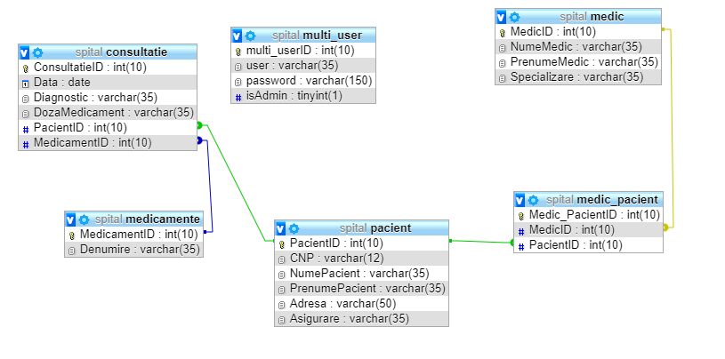
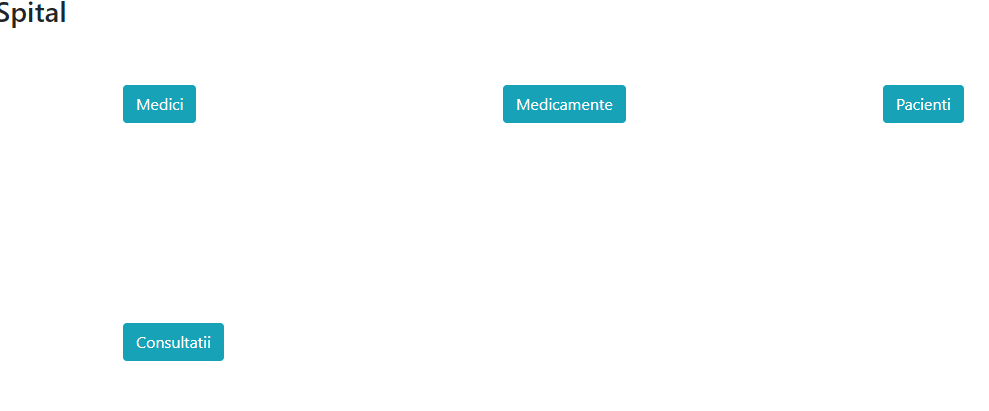
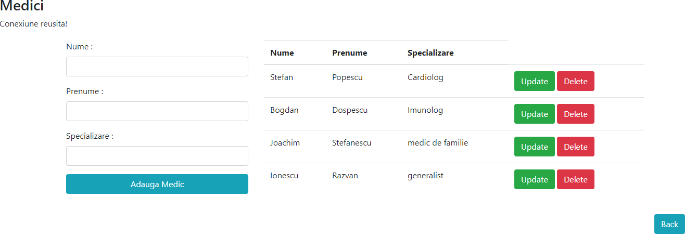
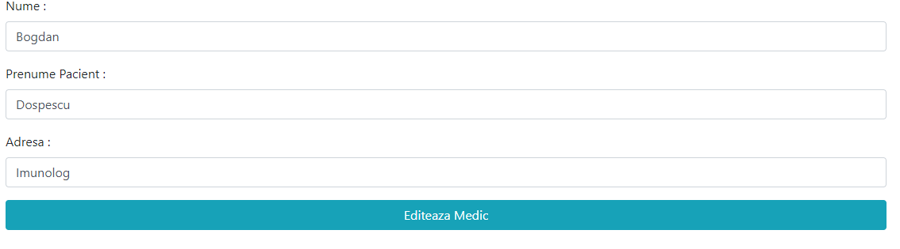
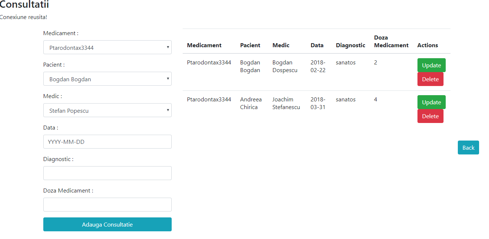
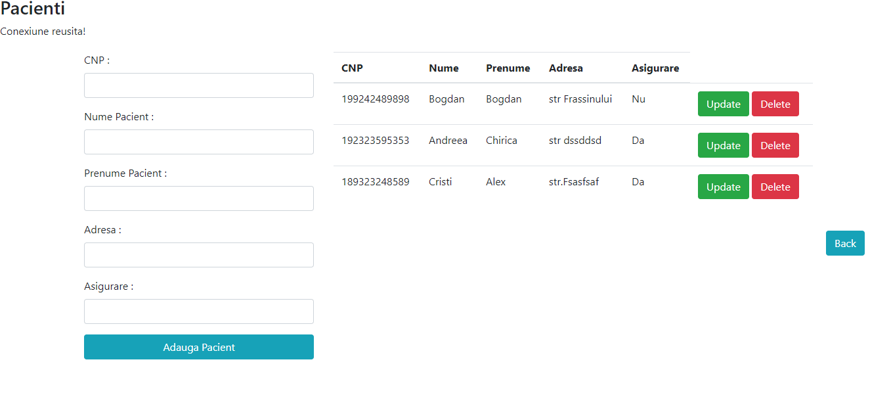
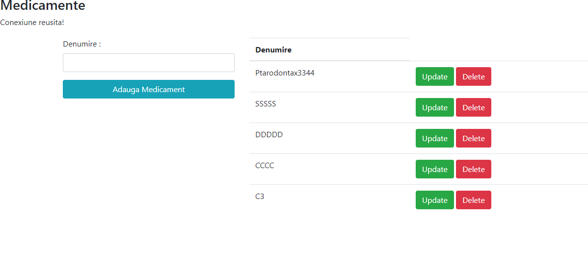

# CRUD-Hospital
Simple CRUD app developed in PHP that implements relations between doctors,pacients and meds.
There are 2 types of users  : client and administrator. 
Passwords are stored as hashes in the database .

## Database Schema 
 
 
 
 
 
 
 
 
 
